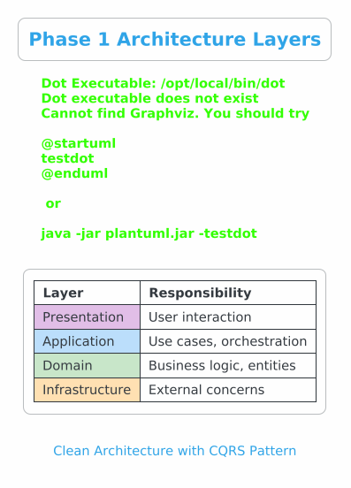
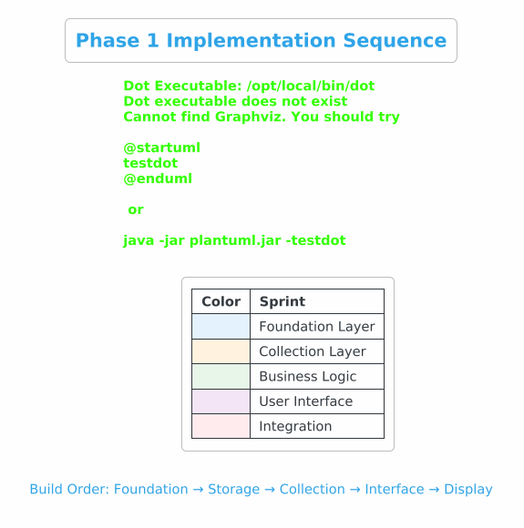

# Phase 1 Technical Implementation Roadmap

## Automated Market Intelligence Tool - MVP

**Version:** 1.0
**Last Updated:** 2026-01-08
**Status:** Active Development

---

## Table of Contents

1. [Executive Summary](#executive-summary)
2. [Implementation Philosophy](#implementation-philosophy)
3. [Architecture Overview](#architecture-overview)
4. [Implementation Sequence](#implementation-sequence)
5. [Sprint Breakdown](#sprint-breakdown)
6. [Technical Specifications](#technical-specifications)
7. [Risk Mitigation](#risk-mitigation)
8. [Definition of Done](#definition-of-done)

---

## Executive Summary

Phase 1 (MVP) delivers a functional car listing search tool capable of:
- Scraping 2-3 major automotive listing sites (Autotrader.ca, Kijiji.ca)
- Persisting listings to a local SQLite database
- Detecting duplicate listings via VIN and External ID matching
- Providing CLI-based search with configurable filters
- Outputting results in table, JSON, and CSV formats

### Key Metrics
| Metric | Target |
|--------|--------|
| Sites Supported | 2-3 |
| Search Filters | 6 (make, model, year, price, mileage, location) |
| Output Formats | 3 (table, JSON, CSV) |
| Data Fields Extracted | 15+ per listing |

---

## Implementation Philosophy

### Build Order Rationale

The implementation follows a **bottom-up, dependency-driven** approach:

```
Foundation (Core) → Storage (Infrastructure) → Collection (Scrapers) → Interface (CLI) → Display (Reporting)
```

**Why this order?**

1. **Core Domain First**: All other layers depend on domain models. Building these first establishes the ubiquitous language and data contracts.

2. **Infrastructure Second**: Persistence must exist before we can save scraped data. Testing scrapers without storage creates throwaway work.

3. **Scrapers Third**: Once we can store data, scrapers become meaningful. Each scraper can be independently validated against the database.

4. **CLI Fourth**: The interface orchestrates scrapers and queries storage. It requires both to be functional.

5. **Reporting Last**: Display logic depends on data existing in the system. Building it last ensures realistic test data.

### Design Patterns Applied

| Pattern | Application | Rationale |
|---------|-------------|-----------|
| **CQRS (MediatR)** | API layer | Separates read/write concerns, enables independent scaling |
| **Strategy Pattern** | Web Scrapers | Each site has unique DOM structure; strategy enables plug-and-play scrapers |
| **Factory Pattern** | Scraper Creation | Dynamic scraper instantiation based on target site |
| **Unit of Work** | EF Core DbContext | Atomic transactions across aggregate operations |
| **Specification Pattern** | Search Filters | Composable query predicates for flexible filtering |

### Patterns Explicitly Avoided

| Pattern | Reason |
|---------|--------|
| **Repository Pattern** | Per REQ-SYS-005/006 - Direct DbContext access required |
| **Generic Repository** | Over-abstraction that hides EF Core capabilities |
| **AutoMapper** | Per specs - Manual `ToDto()` extension methods preferred |
| **NgRx (Frontend)** | Per REQ-FE-007 - RxJS observables used instead |
| **Angular Signals** | Per REQ-FE-008 - Observable async pipe pattern required |

---

## Architecture Overview

### Layer Dependencies



```
┌─────────────────────────────────────────────────────────────┐
│                    PRESENTATION LAYER                        │
│  ┌─────────────┐  ┌─────────────┐  ┌─────────────────────┐  │
│  │    CLI      │  │   WebApp    │  │        API          │  │
│  │ (Spectre)   │  │  (Angular)  │  │     (ASP.NET)       │  │
│  └──────┬──────┘  └──────┬──────┘  └──────────┬──────────┘  │
└─────────┼────────────────┼────────────────────┼─────────────┘
          │                │                    │
          ▼                ▼                    ▼
┌─────────────────────────────────────────────────────────────┐
│                    APPLICATION LAYER                         │
│  ┌──────────────────────────────────────────────────────┐   │
│  │              MediatR Commands & Queries               │   │
│  │         (SearchListingsQuery, ScrapeCommand)          │   │
│  └──────────────────────────────────────────────────────┘   │
└─────────────────────────────────────────────────────────────┘
          │
          ▼
┌─────────────────────────────────────────────────────────────┐
│                      DOMAIN LAYER                            │
│  ┌─────────────┐  ┌─────────────┐  ┌─────────────────────┐  │
│  │   Listing   │  │   Search    │  │      Location       │  │
│  │  Aggregate  │  │   Config    │  │       Config        │  │
│  └─────────────┘  └─────────────┘  └─────────────────────┘  │
│  ┌──────────────────────────────────────────────────────┐   │
│  │              Domain Services (Core)                   │   │
│  │     DuplicateDetectionService, SearchService          │   │
│  └──────────────────────────────────────────────────────┘   │
└─────────────────────────────────────────────────────────────┘
          │
          ▼
┌─────────────────────────────────────────────────────────────┐
│                  INFRASTRUCTURE LAYER                        │
│  ┌─────────────┐  ┌─────────────┐  ┌─────────────────────┐  │
│  │  DbContext  │  │   Scrapers  │  │    Site Adapters    │  │
│  │  (EF Core)  │  │ (Playwright)│  │  (Autotrader, etc)  │  │
│  └─────────────┘  └─────────────┘  └─────────────────────┘  │
└─────────────────────────────────────────────────────────────┘
```

### Project Structure

```
src/
├── AutomatedMarketIntelligenceTool.Core/
│   ├── Models/
│   │   ├── ListingAggregate/
│   │   │   ├── Listing.cs
│   │   │   ├── ListingId.cs
│   │   │   ├── Enums/
│   │   │   │   ├── Condition.cs
│   │   │   │   ├── FuelType.cs
│   │   │   │   └── Transmission.cs
│   │   │   └── Events/
│   │   │       ├── ListingCreated.cs
│   │   │       └── ListingPriceChanged.cs
│   │   └── SearchConfigAggregate/
│   │       ├── SearchConfig.cs
│   │       └── SearchConfigId.cs
│   ├── Services/
│   │   ├── DuplicateDetectionService.cs
│   │   ├── IDuplicateDetectionService.cs
│   │   ├── SearchService.cs
│   │   └── ISearchService.cs
│   └── IAutomatedMarketIntelligenceToolContext.cs
│
├── AutomatedMarketIntelligenceTool.Infrastructure/
│   ├── AutomatedMarketIntelligenceToolContext.cs
│   ├── EntityConfigurations/
│   │   ├── ListingConfiguration.cs
│   │   └── SearchConfigConfiguration.cs
│   ├── Migrations/
│   └── Services/
│       └── Scrapers/
│           ├── IScraperFactory.cs
│           ├── ScraperFactory.cs
│           ├── ISiteScraper.cs
│           ├── BaseScaper.cs
│           ├── AutotraderScraper.cs
│           └── CarsComScraper.cs
│
├── AutomatedMarketIntelligenceTool.Api/
│   ├── Features/
│   │   ├── Listings/
│   │   │   ├── SearchListingsQuery.cs
│   │   │   ├── GetListingByIdQuery.cs
│   │   │   └── ListingDto.cs
│   │   └── Scraping/
│   │       ├── StartScrapeCommand.cs
│   │       └── GetScrapeStatusQuery.cs
│   └── Controllers/
│       ├── ListingsController.cs
│       └── ScrapingController.cs
│
└── AutomatedMarketIntelligenceTool.Cli/
    ├── Program.cs
    ├── Commands/
    │   ├── SearchCommand.cs
    │   └── ScrapeCommand.cs
    └── Formatters/
        ├── IOutputFormatter.cs
        ├── TableFormatter.cs
        ├── JsonFormatter.cs
        └── CsvFormatter.cs
```

---

## Implementation Sequence



### Phase 1 Implementation Order

```
Sprint 1: Foundation
    │
    ├── 1.1 Core Domain Models
    │       ├── Listing Aggregate (entity, value objects, enums)
    │       ├── SearchConfig Aggregate
    │       └── Domain Events
    │
    └── 1.2 Infrastructure Setup
            ├── DbContext Implementation
            ├── Entity Configurations
            └── Initial Migration

Sprint 2: Data Collection
    │
    ├── 2.1 Scraper Foundation
    │       ├── ISiteScraper Interface
    │       ├── BaseScraper Abstract Class
    │       └── ScraperFactory
    │
    ├── 2.2 Autotrader Scraper
    │       ├── Search URL Builder
    │       ├── Listing Parser
    │       └── Pagination Handler
    │
    └── 2.3 Cars.com Scraper
            ├── Search URL Builder
            ├── Listing Parser
            └── Pagination Handler

Sprint 3: Business Logic
    │
    ├── 3.1 Duplicate Detection
    │       ├── VIN-based Detection
    │       ├── External ID Detection
    │       └── New Listing Flagging
    │
    └── 3.2 Search Service
            ├── Filter Specifications
            ├── Query Builder
            └── Result Pagination

Sprint 4: User Interface
    │
    ├── 4.1 CLI Framework
    │       ├── Command Structure
    │       ├── Argument Parsing
    │       └── Error Handling
    │
    ├── 4.2 Output Formatters
    │       ├── Table Formatter
    │       ├── JSON Formatter
    │       └── CSV Formatter
    │
    └── 4.3 Progress Indication
            ├── Scraping Progress
            └── Search Progress

Sprint 5: Integration & Polish
    │
    ├── 5.1 End-to-End Testing
    │       ├── Scrape → Store Flow
    │       ├── Search → Display Flow
    │       └── Duplicate Detection Flow
    │
    └── 5.2 Documentation & Cleanup
            ├── User Documentation
            ├── Code Cleanup
            └── Performance Optimization
```

---

## Sprint Breakdown

### Sprint 1: Foundation Layer

#### Goals
- Establish domain model foundation
- Create persistence layer with SQLite
- Configure multi-tenancy infrastructure

#### Tasks

| ID | Task | Dependencies | Priority |
|----|------|--------------|----------|
| S1-01 | Create Listing entity with all fields | None | P0 |
| S1-02 | Create Listing value objects (ListingId) | S1-01 | P0 |
| S1-03 | Create Listing enums (Condition, FuelType, Transmission) | None | P0 |
| S1-04 | Create IAutomatedMarketIntelligenceToolContext interface | S1-01 | P0 |
| S1-05 | Implement DbContext with SQLite | S1-04 | P0 |
| S1-06 | Create ListingConfiguration (EF) | S1-01, S1-05 | P0 |
| S1-07 | Add TenantId to Listing aggregate | S1-01 | P1 |
| S1-08 | Configure global query filter for TenantId | S1-05, S1-07 | P1 |
| S1-09 | Create initial migration | S1-05, S1-06 | P0 |
| S1-10 | Add unit tests for domain models | S1-01 | P1 |

#### Acceptance Criteria
- [ ] Listing entity has all required fields per REQ-DP-002
- [ ] SQLite database can be created via migration
- [ ] TenantId filtering works correctly
- [ ] All naming conventions follow specs (ListingId not Id)

#### Key Code Artifacts

**Listing.cs** (Core/Models/ListingAggregate/)
```csharp
namespace AutomatedMarketIntelligenceTool.Core.Models.ListingAggregate;

public class Listing
{
    public ListingId ListingId { get; private set; }
    public Guid TenantId { get; private set; }
    public string ExternalId { get; private set; }
    public string SourceSite { get; private set; }
    public string ListingUrl { get; private set; }
    public string Make { get; private set; }
    public string Model { get; private set; }
    public int Year { get; private set; }
    public string? Trim { get; private set; }
    public decimal Price { get; private set; }
    public int? Mileage { get; private set; }
    public string? Vin { get; private set; }
    public string? City { get; private set; }
    public string? State { get; private set; }
    public string? ZipCode { get; private set; }
    public Condition Condition { get; private set; }
    public Transmission? Transmission { get; private set; }
    public FuelType? FuelType { get; private set; }
    public string? BodyStyle { get; private set; }
    public string? ExteriorColor { get; private set; }
    public string? InteriorColor { get; private set; }
    public string? Description { get; private set; }
    public List<string> ImageUrls { get; private set; } = new();
    public DateTime FirstSeenDate { get; private set; }
    public DateTime LastSeenDate { get; private set; }
    public bool IsNewListing { get; private set; }
    public DateTime CreatedAt { get; private set; }
    public DateTime? UpdatedAt { get; private set; }
}
```

---

### Sprint 2: Data Collection Layer

#### Goals
- Implement Playwright-based web scraping
- Create scrapers for 2 major sites
- Handle pagination and error recovery

#### Tasks

| ID | Task | Dependencies | Priority |
|----|------|--------------|----------|
| S2-01 | Add Playwright NuGet package | None | P0 |
| S2-02 | Create ISiteScraper interface | None | P0 |
| S2-03 | Create BaseScraper abstract class | S2-01, S2-02 | P0 |
| S2-04 | Implement ScraperFactory | S2-02 | P0 |
| S2-05 | Create AutotraderScraper | S2-03 | P0 |
| S2-06 | Create CarsComScraper | S2-03 | P0 |
| S2-07 | Implement retry logic (3 attempts) | S2-03 | P1 |
| S2-08 | Implement pagination detection | S2-03 | P0 |
| S2-09 | Add scraper integration tests | S2-05, S2-06 | P1 |
| S2-10 | Implement rate limiting | S2-03 | P2 |

#### Acceptance Criteria
- [ ] Playwright can launch Chromium in headless mode
- [ ] Autotrader scraper extracts all required fields
- [ ] Cars.com scraper extracts all required fields
- [ ] Pagination navigates through all results
- [ ] Retry logic handles transient failures

#### Key Code Artifacts

**ISiteScraper.cs** (Infrastructure/Services/Scrapers/)
```csharp
namespace AutomatedMarketIntelligenceTool.Infrastructure.Services.Scrapers;

public interface ISiteScraper
{
    string SiteName { get; }
    Task<IEnumerable<ScrapedListing>> ScrapeAsync(
        SearchParameters parameters,
        IProgress<ScrapeProgress>? progress = null,
        CancellationToken cancellationToken = default);
}
```

**BaseScraper.cs** (Infrastructure/Services/Scrapers/)
```csharp
namespace AutomatedMarketIntelligenceTool.Infrastructure.Services.Scrapers;

public abstract class BaseScraper : ISiteScraper
{
    protected readonly IPlaywright _playwright;
    protected readonly ILogger _logger;
    protected const int MaxRetries = 3;
    protected const int MaxPages = 50;

    public abstract string SiteName { get; }

    protected abstract string BuildSearchUrl(SearchParameters parameters, int page);
    protected abstract Task<IEnumerable<ScrapedListing>> ParseListingsAsync(IPage page);
    protected abstract Task<bool> HasNextPageAsync(IPage page);

    public async Task<IEnumerable<ScrapedListing>> ScrapeAsync(
        SearchParameters parameters,
        IProgress<ScrapeProgress>? progress = null,
        CancellationToken cancellationToken = default)
    {
        // Implementation with retry logic, pagination, progress reporting
    }
}
```

---

### Sprint 3: Business Logic Layer

#### Goals
- Implement duplicate detection algorithms
- Build search service with filtering
- Create domain services in Core project

#### Tasks

| ID | Task | Dependencies | Priority |
|----|------|--------------|----------|
| S3-01 | Create IDuplicateDetectionService interface | Sprint 1 | P0 |
| S3-02 | Implement VIN-based duplicate detection | S3-01 | P0 |
| S3-03 | Implement ExternalId duplicate detection | S3-01 | P0 |
| S3-04 | Implement new listing flagging logic | S3-02, S3-03 | P0 |
| S3-05 | Create ISearchService interface | Sprint 1 | P0 |
| S3-06 | Implement make/model filtering | S3-05 | P0 |
| S3-07 | Implement year range filtering | S3-05 | P0 |
| S3-08 | Implement price range filtering | S3-05 | P0 |
| S3-09 | Implement mileage range filtering | S3-05 | P0 |
| S3-10 | Implement location/radius filtering | S3-05 | P1 |
| S3-11 | Add pagination support | S3-05 | P0 |
| S3-12 | Add sorting support | S3-05 | P1 |

#### Acceptance Criteria
- [ ] VIN matching is case-insensitive
- [ ] VIN validation requires 17 characters
- [ ] Duplicate ExternalId+SourceSite updates existing record
- [ ] All search filters work independently and combined
- [ ] Results paginate correctly

#### Key Code Artifacts

**DuplicateDetectionService.cs** (Core/Services/)
```csharp
namespace AutomatedMarketIntelligenceTool.Core.Services;

public class DuplicateDetectionService : IDuplicateDetectionService
{
    private readonly IAutomatedMarketIntelligenceToolContext _context;

    public async Task<DuplicateCheckResult> CheckForDuplicateAsync(
        ScrapedListing scrapedListing,
        CancellationToken cancellationToken = default)
    {
        // 1. Check VIN match (if VIN present and valid)
        if (!string.IsNullOrEmpty(scrapedListing.Vin) &&
            scrapedListing.Vin.Length == 17)
        {
            var vinMatch = await _context.Listings
                .FirstOrDefaultAsync(l =>
                    l.Vin.ToUpper() == scrapedListing.Vin.ToUpper(),
                    cancellationToken);

            if (vinMatch != null)
                return DuplicateCheckResult.VinMatch(vinMatch);
        }

        // 2. Check ExternalId + SourceSite match
        var externalIdMatch = await _context.Listings
            .FirstOrDefaultAsync(l =>
                l.ExternalId == scrapedListing.ExternalId &&
                l.SourceSite == scrapedListing.SourceSite,
                cancellationToken);

        if (externalIdMatch != null)
            return DuplicateCheckResult.ExternalIdMatch(externalIdMatch);

        // 3. No match - new listing
        return DuplicateCheckResult.NewListing();
    }
}
```

---

### Sprint 4: User Interface Layer

#### Goals
- Build CLI with Spectre.Console
- Implement all output formats
- Add progress indication

#### Tasks

| ID | Task | Dependencies | Priority |
|----|------|--------------|----------|
| S4-01 | Add Spectre.Console NuGet package | None | P0 |
| S4-02 | Create root command structure | S4-01 | P0 |
| S4-03 | Implement SearchCommand | S4-02, Sprint 3 | P0 |
| S4-04 | Implement ScrapeCommand | S4-02, Sprint 2 | P0 |
| S4-05 | Add argument parsing (short/long options) | S4-02 | P0 |
| S4-06 | Create IOutputFormatter interface | None | P0 |
| S4-07 | Implement TableFormatter | S4-06 | P0 |
| S4-08 | Implement JsonFormatter | S4-06 | P1 |
| S4-09 | Implement CsvFormatter | S4-06 | P1 |
| S4-10 | Add error handling with exit codes | S4-02 | P0 |
| S4-11 | Add progress bars for scraping | S4-04 | P1 |
| S4-12 | Add CLI unit tests | S4-03, S4-04 | P1 |

#### Acceptance Criteria
- [ ] `car-search search` command works with all filters
- [ ] `car-search scrape` command initiates scraping
- [ ] Short options (-m) and long options (--make) work
- [ ] Table output auto-adjusts column widths
- [ ] JSON output is valid and parseable
- [ ] Exit codes follow convention (0=success, 1=error, 2=validation)

#### Key Code Artifacts

**SearchCommand.cs** (Cli/Commands/)
```csharp
namespace AutomatedMarketIntelligenceTool.Cli.Commands;

public class SearchCommand : AsyncCommand<SearchCommand.Settings>
{
    public class Settings : CommandSettings
    {
        [CommandOption("-m|--make")]
        [Description("Vehicle make (e.g., Toyota, Honda)")]
        public string[]? Makes { get; set; }

        [CommandOption("--model")]
        [Description("Vehicle model (e.g., Camry, Civic)")]
        public string[]? Models { get; set; }

        [CommandOption("--year-min")]
        [Description("Minimum year")]
        public int? YearMin { get; set; }

        [CommandOption("--year-max")]
        [Description("Maximum year")]
        public int? YearMax { get; set; }

        [CommandOption("--price-min")]
        [Description("Minimum price")]
        public decimal? PriceMin { get; set; }

        [CommandOption("--price-max")]
        [Description("Maximum price")]
        public decimal? PriceMax { get; set; }

        [CommandOption("-z|--zip")]
        [Description("ZIP code for location search")]
        public string? ZipCode { get; set; }

        [CommandOption("-r|--radius")]
        [Description("Search radius in miles (default: 25)")]
        public int Radius { get; set; } = 25;

        [CommandOption("-f|--format")]
        [Description("Output format: table, json, csv")]
        public string Format { get; set; } = "table";
    }
}
```

---

### Sprint 5: Integration & Polish

#### Goals
- End-to-end testing
- Performance optimization
- Documentation completion

#### Tasks

| ID | Task | Dependencies | Priority |
|----|------|--------------|----------|
| S5-01 | Create E2E test: scrape → store flow | Sprint 2, Sprint 3 | P0 |
| S5-02 | Create E2E test: search → display flow | Sprint 3, Sprint 4 | P0 |
| S5-03 | Create E2E test: duplicate detection flow | Sprint 3 | P0 |
| S5-04 | Performance test: large result sets | All | P1 |
| S5-05 | Add structured logging (Serilog) | All | P1 |
| S5-06 | Create user documentation | Sprint 4 | P1 |
| S5-07 | Code review and cleanup | All | P1 |
| S5-08 | Security review (no credentials in code) | All | P0 |

---

## Technical Specifications

### Database Schema

```sql
CREATE TABLE Listings (
    ListingId UNIQUEIDENTIFIER PRIMARY KEY,
    TenantId UNIQUEIDENTIFIER NOT NULL,
    ExternalId NVARCHAR(100) NOT NULL,
    SourceSite NVARCHAR(50) NOT NULL,
    ListingUrl NVARCHAR(500) NOT NULL,
    Make NVARCHAR(100) NOT NULL,
    Model NVARCHAR(100) NOT NULL,
    Year INT NOT NULL,
    Trim NVARCHAR(100),
    Price DECIMAL(12,2) NOT NULL,
    Mileage INT,
    Vin NVARCHAR(17),
    City NVARCHAR(100),
    State NVARCHAR(50),
    ZipCode NVARCHAR(10),
    Condition INT NOT NULL,
    Transmission INT,
    FuelType INT,
    BodyStyle NVARCHAR(50),
    ExteriorColor NVARCHAR(50),
    InteriorColor NVARCHAR(50),
    Description NVARCHAR(MAX),
    ImageUrls NVARCHAR(MAX),
    FirstSeenDate DATETIME2 NOT NULL,
    LastSeenDate DATETIME2 NOT NULL,
    IsNewListing BIT NOT NULL DEFAULT 1,
    CreatedAt DATETIME2 NOT NULL,
    UpdatedAt DATETIME2,

    CONSTRAINT UQ_Listing_External UNIQUE (SourceSite, ExternalId, TenantId),
    INDEX IX_Listing_Vin (Vin),
    INDEX IX_Listing_TenantId (TenantId),
    INDEX IX_Listing_MakeModel (Make, Model),
    INDEX IX_Listing_Price (Price),
    INDEX IX_Listing_Year (Year)
);
```

### CLI Commands Reference

```bash
# Basic search
car-search search

# Search with filters
car-search search -m Toyota --model Camry --year-min 2020 --price-max 35000

# Search with location
car-search search -m Honda -z 90210 -r 50

# Output formats
car-search search -m Ford --format json
car-search search -m Ford --format csv

# Scraping
car-search scrape --site autotrader -m Toyota --model Camry
car-search scrape --site all -z 90210 -r 25
```

### Error Codes

| Code | Meaning |
|------|---------|
| 0 | Success |
| 1 | General error |
| 2 | Validation error (invalid arguments) |
| 3 | Network error |
| 4 | Database error |
| 5 | Scraping error |

---

## Risk Mitigation

### Technical Risks

| Risk | Probability | Impact | Mitigation |
|------|-------------|--------|------------|
| Website DOM changes | High | High | Abstract selectors, add monitoring, quick update process |
| Rate limiting/blocking | Medium | High | Implement delays, rotate user agents, respect robots.txt |
| Playwright compatibility | Low | Medium | Pin versions, test on CI |
| SQLite performance with large datasets | Medium | Medium | Add indexes, consider pagination limits |

### Mitigation Strategies

1. **DOM Changes**: Create selector configuration files that can be updated without code changes
2. **Rate Limiting**: Implement exponential backoff, configurable delays between requests
3. **Data Quality**: Validate all scraped data, log warnings for missing fields
4. **Performance**: Batch inserts, use async/await properly, profile before optimizing

---

## Definition of Done

### Feature Level
- [ ] All acceptance criteria met
- [ ] Unit tests written and passing (>80% coverage)
- [ ] Integration tests for critical paths
- [ ] Code reviewed and approved
- [ ] No security vulnerabilities
- [ ] Documentation updated

### Sprint Level
- [ ] All P0 tasks completed
- [ ] All P1 tasks completed or deferred with justification
- [ ] E2E tests passing
- [ ] Performance acceptable
- [ ] Tech debt documented

### Phase Level
- [ ] All sprints completed
- [ ] Full E2E flow working
- [ ] User documentation complete
- [ ] Deployment documentation complete
- [ ] Stakeholder demo completed

---

## Diagrams

### Architecture Diagrams
- [Architecture Layers](./diagrams/architecture-layers.png)
- [Implementation Sequence](./diagrams/implementation-sequence.png)
- [Dependency Flow](./diagrams/dependency-flow.png)
- [Implementation Timeline](./diagrams/implementation-timeline.drawio.svg)

### Source Files
- [architecture-layers.puml](./diagrams/architecture-layers.puml)
- [implementation-sequence.puml](./diagrams/implementation-sequence.puml)
- [dependency-flow.puml](./diagrams/dependency-flow.puml)
- [implementation-timeline.drawio](./diagrams/implementation-timeline.drawio)

---

## Appendix

### References
- [Implementation Specs](../../specs/implementation-specs.md)
- [CLI Interface Specs](../../specs/cli-interface/cli-interface.specs.md)
- [Web Scraping Specs](../../specs/web-scraping/web-scraping.specs.md)
- [Data Persistence Specs](../../specs/data-persistence/data-persistence.specs.md)
- [Duplicate Detection Specs](../../specs/duplicate-detection/duplicate-detection.specs.md)
- [Search Configuration Specs](../../specs/search-configuration/search-configuration.specs.md)
- [Location Configuration Specs](../../specs/location-configuration/location-configuration.specs.md)
- [Reporting Specs](../../specs/reporting/reporting.specs.md)

### Changelog
| Version | Date | Author | Changes |
|---------|------|--------|---------|
| 1.0 | 2026-01-08 | Claude | Initial roadmap creation |
